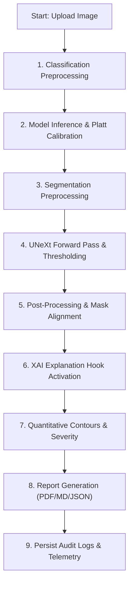

# H7.0 Performance & AI Monitoring Baseline Audit

This audit document establishes the performance, telemetry, database execution, resource utilization, and model monitoring baseline for the AuraScan deep learning brain tumor detection and reporting platform. This is an **audit only**; no production code, tests, database schemas, or configurations have been altered.

---

## 1. Executive Summary

A comprehensive repository-wide audit was conducted to review system latencies, deep learning model loading and health validation, database schema optimization, failure recovery, security boundaries, and API/dashboard timing.

### Core Findings & Gaps
* **Database Query Performance Bottlenecks**:
  * A major N+1 query loop was identified in both the FastAPI `/database/history` and Flask `/api/history` endpoints. For every search result returned, the endpoint makes a synchronous connection call and executes a database query (`SELECT 1 FROM doctor_patient_assignments...`) in a loop to verify physician access.
  * In-memory decryption and sorting are performed in [`prediction_history/infrastructure/repository.py`](file:///d:/BrainTumorProject/UNeXt-pytorch/prediction_history/infrastructure/repository.py#L44-L268). The database fetches all candidate matching rows into RAM, decrypts patient names in Python, performs Python-level filtering (for patient uuid, patient name, and query strings), and executes pagination in memory. As database volume scales, this will lead to severe performance degradation.
* **Infrastructure Data Exposure (Security Gap)**:
  * The GET `/api/health-telemetry` (Flask) and GET `/health` (FastAPI) endpoints allow access to both `ADMIN` and `DOCTOR` roles. This permits doctors to fetch full system specs (CPU core count, active system RAM size, exact VRAM capacity, GPU card names, system uptime, disk path capacities, and local API port configurations).
* **Missing Services Health Checks**:
  * While SQLite and deep learning models are monitored via the `/health` endpoint, there are no checks for email dispatch functionality, notification deliveries, filesystem write validity, or SMTP connectivity.
* **No Telemetry Retention Policy**:
  * System execution telemetry logs (`ai_audit_logs`, `timeline_traces`, `email_deliveries`) grow indefinitely without pruning or cleanup mechanisms.

---

## 2. Existing Performance Architecture

Performance latency tracking is built into the core diagnostic pipeline:
* **Timeline Tracing**: During report generation, individual pipeline stage elapsed times are tracked in a dictionary (`timeline`) inside `_run_single_report_pipeline()` in [`api/infrastructure/routes.py`](file:///d:/BrainTumorProject/UNeXt-pytorch/api/infrastructure/routes.py#L495-L1078).
* **Persistence**:
  * Timelines are saved to the `timeline_traces` table as JSON strings via `db_repo.save_timeline_trace(pred_id, timeline)` in [`persistence/infrastructure/repository.py`](file:///d:/BrainTumorProject/UNeXt-pytorch/persistence/infrastructure/repository.py#L1275-L1283).
  * Total duration is saved as `runtime_sec` in `ai_audit_logs` via `AuditLogger.log_execution()` in [`monitoring/infrastructure/audit_logger.py`](file:///d:/BrainTumorProject/UNeXt-pytorch/monitoring/infrastructure/audit_logger.py#L15-L54).
* **Aggregates**: Historical performance values are loaded via `get_health_telemetry()` in [`persistence/infrastructure/repository.py`](file:///d:/BrainTumorProject/UNeXt-pytorch/persistence/infrastructure/repository.py#L1197-L1270), calculating average classification execution latency using `SELECT AVG(runtime_sec) FROM ai_audit_logs;`.

---

## 3. Existing AI Monitoring

The application tracks operational metrics for the classification, segmentation, and explainability stages:
* **Validation Scorecards**: Persisted in the `mri_scan_validation` table via `save_validation_scorecard()` in [`persistence/infrastructure/repository.py`](file:///d:/BrainTumorProject/UNeXt-pytorch/persistence/infrastructure/repository.py#L1046-L1080). It captures file format, dimensions, corruption, duplicate status, and file perceptual hash (`p_hash`).
* **Quality Warnings**: Evaluated using the `CentralWarningEngine` in [`monitoring/application/warning_engine.py`](file:///d:/BrainTumorProject/UNeXt-pytorch/monitoring/application/warning_engine.py#L7-L96). It runs:
  * Segmentation validation checks (empty mask, outlier sizes).
  * Classification consistency checks (mismatches between predicted class and segmentation findings, calibrated vs uncalibrated confidence).
  * Explainability overlay checks (Grad-CAM overlap percentage).
  * Input errors from validations.
* **Warnings Logging**: The aggregated warnings list is stored in the database in `ai_audit_logs.warnings_json`.
* **Telemetry Queries**: Historical model aggregates (such as diagnostic class distribution, average model confidence, average tumor size, average XAI overlay percentage, and frequency of XAI methods used) are compiled using `get_health_telemetry()`.

---

## 4. AI Pipeline Timing Analysis

The AI pipeline is orchestrated inside `_run_single_report_pipeline()` of [`api/infrastructure/routes.py`](file:///d:/BrainTumorProject/UNeXt-pytorch/api/infrastructure/routes.py#L495-L1078). Below is the trace of execution and latency measurements:



### Trace Steps & Metrics:
1. **Classification Pipeline**:
   * **Location**: [`api/infrastructure/routes.py#L515-L580`](file:///d:/BrainTumorProject/UNeXt-pytorch/api/infrastructure/routes.py#L515-L580)
   * **Inference**: Executes `predict_use_case.execute` or `ModelRegistry`/`EnsembleEngine` if `ensemble_mode` is requested.
   * **Fallback**: CPU execution retry on failure.
   * **Metrics**: Start/end timing recorded (`cls_latency = time.time() - t_cls`), device selection (`active_cls_device`), and warnings.
2. **Segmentation Pipeline**:
   * **Location**: [`api/infrastructure/routes.py#L625-L689`](file:///d:/BrainTumorProject/UNeXt-pytorch/api/infrastructure/routes.py#L625-L689)
   * **Inference**: Preprocesses and runs UNeXt model under AMP autocast (`torch.amp.autocast`). Sigmoid thresholding converts output to a binary mask.
   * **Fallback**: CPU fallback on failure; generates a blank zero mask on complete collapse to ensure graceful degradation.
   * **Metrics**: Latency recorded (`seg_latency = time.time() - t_seg`), device selection (`active_seg_device`), and quality score metadata.
3. **Explainability Pipeline**:
   * **Location**: [`api/infrastructure/routes.py#L581-L623`](file:///d:/BrainTumorProject/UNeXt-pytorch/api/infrastructure/routes.py#L581-L623)
   * **Execution**: Runs `PyTorchXAIEngine` on the classification model's target backbone features (`model_cls.backbone.features[8]`).
   * **Fallback**: Graceful fallback values applied on failure.
   * **Metrics**: Start/end timing (`cam_latency = time.time() - t_cam`), method selection (Grad-CAM, Grad-CAM++, EigenCAM), and overlap percentage with the segmentation mask.
4. **Batch Processing Pipeline**:
   * **Location**: [`api/infrastructure/routes.py#L1084-L1334`](file:///d:/BrainTumorProject/UNeXt-pytorch/api/infrastructure/routes.py#L1084-L1334)
   * **Execution**: Processes uploaded files sequentially in a single-threaded loop, validating and routing each image to `_run_single_report_pipeline()`.
   * **Metrics**: Tracks batch size (`total_files`), valid/invalid counts, duplicate count, successful/failed count, processing duration per file, and total batch duration (`total_duration_sec`).

---

## 5. Model Monitoring

Models are preloaded into memory on server start to avoid execution timing spikes during lazy loading:
* **Loading Service**: `initialize_api_models()` in [`api/infrastructure/routes.py`](file:///d:/BrainTumorProject/UNeXt-pytorch/api/infrastructure/routes.py#L63-L101) loads checkpoints from `models/classification/efficientnet_b0_brain_tumor.pth` and `models/brain_tumor_unext/model.pth`.
* **Device Selection**: GPU (`cuda`) is selected if available; fallback to CPU occurs automatically. Thread count is tuned to 4 threads on CPU to prevent resource over-utilization.
* **Weight Health Scan**: The `/health` endpoint executes mock inferences and checks parameters for NaN or Inf weight corruptions via `verify_models()` in [`monitoring/infrastructure/health_monitor.py`](file:///d:/BrainTumorProject/UNeXt-pytorch/monitoring/infrastructure/health_monitor.py#L110-L159).
* **Question**: "What model generated this prediction?"
  * **Answer**: The system has **partial** tracking. `ai_audit_logs` records the file basename of loaded checkpoints (`model_version_cls` and `model_version_seg`) corresponding to the `prediction_id`.
  * **Gaps**:
    1. Checkpoint path basenames are hardcoded string mappings during load rather than cryptographic hashes.
    2. Version information is not stored directly in the core `predictions` table, and could be lost if audit logs are pruned or deleted.

---

## 6. AI Quality Monitoring

Clinical quality metrics are distinguished from runtime execution latencies:

| Quality Dimension | Metric Monitored | Location | Persisted? | Displayed? |
| :--- | :--- | :--- | :--- | :--- |
| **Prediction Confidence** | Confidence score probability | `predictions.confidence_score` | Yes (DB) | Yes (Doctor UI) |
| **Probability Calibration** | Calibrated flag, Platt Scaling method | `predictions.rule_based_severity` | Yes (DB) | Yes (Doctor UI) |
| **Prediction Distribution** | Classification counts per category | `predictions.predicted_class` | Yes (DB) | Yes (Analytics Chart) |
| **Severity Distribution** | Counts of Low, Medium, High severity | `predictions.rule_based_severity` | Yes (DB) | Yes (Analytics Chart) |
| **Tumor Quantitative Size**| Tumor area in $mm^2$, brain percentage | `predictions.tumor_area_mm2` | Yes (DB) | Yes (Doctor UI) |
| **Spatial Correspondence** | XAI-to-Segmentation overlap % | `clinical_reports.xai_overlap_percentage`| Yes (DB)| Yes (Doctor UI) |
| **Inference Failures** | Execution exceptions | `ai_audit_logs.errors_json` | Yes (DB) | No (Admin Log only) |
| **Rejected Scans** | Invalid/Corrupted files scorecard | `mri_scan_validation.scorecard_json` | Yes (DB) | No (API response) |
| **Duplicate Uploads** | Perceptual hash collision flag | `mri_scan_validation.is_valid = 0` | Yes (DB) | Yes (Doctor UI count) |

*Note: In accordance with clinical validation rules, model diagnostic performance metrics (such as Dice score, accuracy, sensitivity, and specificity) are not collected because the application does not compare predictions against physician ground-truth annotations in production.*

---

## 7. System Resource Monitoring

Hardware monitoring is implemented dynamically using zero-dependency Windows kernel structures:
* **Metrics Collected**:
  * **CPU**: Threads, physical cores count (via `multiprocessing.cpu_count()`).
  * **RAM**: Total memory size, available memory size, percentage usage (via Windows kernel `GlobalMemoryStatusEx` DLL call).
  * **Disk**: Total size, free size, usage percent (via `shutil.disk_usage`).
  * **GPU/VRAM**: CUDA availability, GPU card name, total VRAM, used VRAM, free VRAM (via `torch.cuda`).
  * **Uptime**: System uptime in seconds (via Windows kernel `GetTickCount64` DLL call).
* **Location**: `get_system_metrics()` in [`monitoring/infrastructure/health_monitor.py`](file:///d:/BrainTumorProject/UNeXt-pytorch/monitoring/infrastructure/health_monitor.py#L38-L108).
* **Persisted?**: **No**. Hardware metrics are collected on-demand and returned dynamically via the API endpoint. They are not persisted to database tables or file logs.
* **Exposed to**: Exposed via `/health` (FastAPI) and `/api/health-telemetry` (Flask) to both `ADMIN` and `DOCTOR` roles. Restricting these infrastructure metrics to `ADMIN` only is recommended to ensure robust security boundaries.

---

## 8. API Performance

FastAPI and Flask routes handle API endpoints:
* **Timing Telemetry**: Execution durations are measured inside the prediction endpoints, but there is no custom request-timing middleware (the `api/middleware` and `api/services` folders are empty).
* **API Health endpoints**:
  * `/ping`: Unauthenticated GET endpoint returning system timestamp. Serves as a basic liveness probe.
  * `/health`: Authenticated GET endpoint returning the hardware diagnostics and database health metrics.
* **Key Routes Audited**:
  * **Upload**: `/api/upload` (FastAPI) - validates format, perceptual hash, and logs upload telemetry.
  * **Prediction**: `/api/report` (FastAPI) - executes inference, compiles visualization layers, and persists results.
  * **Batch**: `/api/report/batch` (FastAPI) - handles batch ingestion, logging results per file.
  * **Reports**: `/api/reports/{report_id}` (FastAPI) & `/api/report/<int:report_id>` (Flask) - fetches report metadata.
  * **Annotations**: `/api/doctor/scans/{scan_id}/point-annotations` & `/api/doctor/scans/{scan_id}/rectangle-annotations` - logs annotations.
  * **Follow-ups**: `/api/patients/{patient_id}/followups` - manages follow-up appointments.

---

## 9. Database Performance

SQLite is configured with performance pragmas in [`persistence/infrastructure/repository.py`](file:///d:/BrainTumorProject/UNeXt-pytorch/persistence/infrastructure/repository.py#L31-L36):
```sql
PRAGMA journal_mode = WAL;
PRAGMA synchronous = NORMAL;
PRAGMA cache_size = -2000;
PRAGMA temp_store = MEMORY;
```
Indexes exist for foreign keys and query parameters. However, major query bottlenecks were identified:

### 1. The N+1 Database Query Loop (High Risk)
In [`api/infrastructure/routes.py#L1655-L1657`](file:///d:/BrainTumorProject/UNeXt-pytorch/api/infrastructure/routes.py#L1655-L1657) and [`dashboard/infrastructure/web_server.py#L1083-L1087`](file:///d:/BrainTumorProject/UNeXt-pytorch/dashboard/infrastructure/web_server.py#L1083-L1087):
```python
for s in summaries:
    if not auth_svc.can_access_patient(current_user, s.patient_id):
        continue
```
For every summary item returned by search criteria, `can_access_patient()` opens a database connection and executes a query to check doctor assignments:
```sql
SELECT 1 FROM doctor_patient_assignments WHERE doctor_id = ? AND patient_id = ?;
```
If a doctor has 100 patient scans, this results in **100 consecutive database queries** inside a single HTTP request loop.

### 2. In-Memory Decryption, Filtering, and Pagination
In [`prediction_history/infrastructure/repository.py#L165-L262`](file:///d:/BrainTumorProject/UNeXt-pytorch/prediction_history/infrastructure/repository.py#L165-L262):
1. The repository runs a broad SQLite SELECT statement and fetches **all candidate rows** into memory.
2. It decrypts patient names in Python using the `PIIEncryptionService`.
3. It performs Python-level filtering on patient name substrings, UUID matches, and search query keywords (`criteria.q`).
4. It performs pagination in Python (`filtered_candidates[offset : offset + criteria.page_size]`).
This memory-intensive pipeline bypasses database search indexing and will degrade performance as patient database volume grows.

---

## 10. Batch Performance

The batch execution route `/report/batch` runs sequential inferences:
* **Timings Monitored**:
  * Total batch execution time (`stats["total_duration_sec"]`).
  * Ingestion processing time per file (`results[i]["processing_time"]`).
  * File-specific failure status (`error_code`: `VALIDATION_ERROR`, `DUPLICATE_FILE`, `UNSUPPORTED_FORMAT`, `CORRUPTED_IMAGE`, `INFERENCE_ERROR`, `DATABASE_ERROR`, `SEGMENTATION_ERROR`, `EXPLAINABILITY_ERROR`).
* **Performance Gaps**:
  * Processing runs sequentially in a single thread, with no parallel worker pool.
  * Individual classification, segmentation, and Grad-CAM latencies are not returned per item in the batch results (only overall file duration is returned).
  * Ingestion queue or wait times are not tracked.

---

## 11. Dashboard Monitoring

Clinical metrics are displayed across dashboards, but access permissions require review:
* **Doctor Dashboard**: Displays average model confidence, average execution latency, and duplicate upload counts.
* **Patient Dashboard**: Exposes only clinical report PDFs and longitudinal timelines. No infrastructure details or latency statistics are exposed to the patient role.
* **Admin Dashboard**: Exposes database table counts and security audit logs, but does not display infrastructure performance metrics (CPU/RAM/VRAM loads).
* **Security/Aesthetics Discrepancy**: The GET `/api/health-telemetry` endpoint is queried by the Doctor dashboard, but the dashboard only uses 4 high-level variables. Detailed infrastructure metrics are sent in the payload to the doctor's browser but remain hidden in the UI.

---

## 12. Health Checks

Health checks are implemented in `verify_components()` of [`monitoring/infrastructure/health_monitor.py`](file:///d:/BrainTumorProject/UNeXt-pytorch/monitoring/infrastructure/health_monitor.py#L161-L253). Their baseline coverage is as follows:

| System Component | Check Status | Implementation Details |
| :--- | :---: | :--- |
| **API Server** | 🟡 **PARTIAL** | GET ping request to local API docs URL via `urllib.request`. |
| **Database** | 🟢 **COMPLETE** | Connects to SQLite and queries table names. |
| **Classification Model**| 🟢 **COMPLETE** | Runs mock forward pass and scans weights for NaN/Inf. |
| **Segmentation Model** | 🟢 **COMPLETE** | Runs mock forward pass and scans weights for NaN/Inf. |
| **Email Service** | 🔴 **MISSING** | SMTP port checks, connection validations, or delivery validations are not included. |
| **Notifications** | 🔴 **MISSING** | Database table write and channel health checks are not performed. |
| **Audit Logging** | 🔴 **MISSING** | The status of the audit logger is not verified separately from the database check. |
| **Storage / Filesystem** | 🟡 **PARTIAL** | Checks disk space metrics and calibration settings file presence. |

---

## 13. Failure Monitoring

System responses to component execution failures:

* **Model Load Failure**: If classification or segmentation model weights fail to load, the error is caught, logged to console, and the models remain `None`. Subsequent prediction runs fail with an HTTP 500 error, and the `/health` endpoint flags the models as `CRITICAL (Not Loaded)`.
* **Inference Failure**: If GPU execution fails, the system retries execution on CPU (`PipelineExecutionRecovery.run_inference_with_fallback`). If CPU fallback also fails, the exception is caught, logged as critical, and returns an HTTP 500 error.
* **Segmentation Failure**: If both GPU and CPU segmentations fail, the system generates an empty mask (zeros), logs a warning, and completes the API request with a low severity level and warnings.
* **Database Failure**: If audit logging or database persistence fails, the exception is caught and logged. The prediction endpoint continues execution where possible to avoid complete service disruption.
* **Email Delivery Failure**: Transient connection errors update the status in the `email_deliveries` table to `RETRY_PENDING` and schedule a retry. Permanent failures update the status to `FAILED`. Failed dispatches trigger administrator notifications detailing the error.

---

## 14. Security & Privacy

Data privacy controls for performance monitoring:
* **PII Leaks Check**:
  * Database credentials, passwords, JWT secrets, and SMTP credentials are not exposed in logs or telemetry tables.
  * Patient names are encrypted at rest using AES-GCM (prefix `enc:v1:`) in the `patients` table.
  * In-memory decryption occurs only during authorized searches, ensuring decrypted names are never written to audit tables.
* **RBAC Controls**:
  * Unauthenticated requests to monitoring endpoints are blocked.
  * The doctor role has full access to the `/api/health-telemetry` endpoint, exposing detailed hardware specifications. Restricting this data to administrative roles is recommended.
  * Patient users are blocked from monitoring endpoints.
  * Multi-tenant data isolation checks (`auth_svc.can_access_patient`) prevent doctors from querying history records for unassigned patients.

---

## 15. Retention & Storage

* **Metrics Storage**: Telemetry is persisted directly in SQLite tables (`ai_audit_logs`, `timeline_traces`, `mri_scan_validation`, `email_deliveries`, `security_audit_logs`).
* **Retention Policy**: **None**. There are no automated prune, archival, or cleanup jobs.
* **Growth Risk**:
  * In production, execution logs and timeline JSON strings grow indefinitely.
  * High-volume batch processing will steadily increase SQLite file size, eventually degrading query times.
  * Decrypting and filtering database queries in memory (as done in `search_history`) will experience severe latency degradation as database volume increases.

---

## 16. Existing Test Coverage

Performance, telemetry, health check, and authorization tests:

### 1. System Health Diagnostics
* **File**: [`tests/test_health.py`](file:///d:/BrainTumorProject/UNeXt-pytorch/tests/test_health.py)
  * `test_get_system_metrics`: Verifies system resource metrics query.
  * `test_verify_models_with_none`: Checks status when model objects are not loaded.
  * `test_verify_models_forward_pass_mocked`: Validates forward pass checks using mock models.
  * `test_verify_components_dependencies`: Verifies third-party library imports and path checks.

### 2. Timings & Operations Persistence
* **File**: [`tests/test_operations.py`](file:///d:/BrainTumorProject/UNeXt-pytorch/tests/test_operations.py)
  * `test_model_version_manager`: Asserts version manager maps config properties.
  * `test_pipeline_recovery_graceful_success`: Tests successful stage executions.
  * `test_pipeline_recovery_graceful_fallback`: Tests CPU retry and recovery workflows.
  * `test_timeline_persistence`: Verifies writing and loading step latencies from `timeline_traces`.

### 3. Execution Auditing
* **File**: [`tests/test_audit_logger.py`](file:///d:/BrainTumorProject/UNeXt-pytorch/tests/test_audit_logger.py)
  * `test_log_execution_creates_record`: Asserts database logs contain runtime metrics.
  * `test_get_telemetry_queries_database`: Asserts `get_health_telemetry()` computes average runtime.

### 4. Client Telemetry Ingestion
* **File**: [`tests/test_h54_telemetry.py`](file:///d:/BrainTumorProject/UNeXt-pytorch/tests/test_h54_telemetry.py)
  * `test_01_flask_propagates_request_telemetry`: Verifies Flask CSRF audits store client User-Agent.
  * `test_02_fastapi_propagates_request_telemetry`: Verifies FastAPI uploads store client User-Agent.
  * `test_03_background_job_falls_back_safely`: Verifies localhost IP and system client fallbacks.
  * `test_04_proxy_ip_handling_based_on_trust`: Verifies `X-Forwarded-For` parsing based on proxy settings.

### 5. Database Query Optimization
* **File**: [`tests/test_h64_optimization.py`](file:///d:/BrainTumorProject/UNeXt-pytorch/tests/test_h64_optimization.py)
  * `test_01_fresh_database_index_creation`: Checks for notifications index.
  * `test_02_existing_database_migration_and_repeated_runs`: Asserts index creation is idempotent.
  * `test_03_preservation_of_h63_idempotency_index`: Verifies index does not conflict with uniqueness rules.
  * `test_04_listing_pagination_and_unread_count_correctness`: Verifies query sorting and page ranges.
  * `test_05_authorization_and_idor_correctness`: Verifies listing checks enforce user authorization boundaries.
  * `test_06_explain_query_plan_index_usage`: Uses EXPLAIN QUERY PLAN to verify the index is used, avoiding temp B-tree sorting.

### 6. Role-Based Access Control
* **File**: [`tests/test_rbac_integration.py`](file:///d:/BrainTumorProject/UNeXt-pytorch/tests/test_rbac_integration.py)
  * `test_health_telemetry_endpoint_rbac` (lines 263-289): Verifies access to `/api/health-telemetry` is restricted to doctors and administrators.

---

## 17. H7 Roadmap Mapping

### AI Performance Capabilities
* 🟢 **COMPLETE**: Latency measurements are recorded for classification, segmentation, and explainability stages.
* 🟢 **COMPLETE**: GPU vs CPU usage and fallback flags are tracked per run.
* 🟡 **PARTIAL**: Process-specific memory consumption is not measured (uses system-wide statistics).
* 🟡 **PARTIAL**: Overall error rate is computed over audit logs, but not tracked dynamically as a running time-series metric.

### AI Monitoring Capabilities
* 🟢 **COMPLETE**: Prediction confidence distribution and classification distribution are tracked.
* 🟢 **COMPLETE**: Model paths and checkpoints version information are logged in audit tables.
* 🟢 **COMPLETE**: Inference device fallbacks and runtime warning checks are stored.

### System Health Capabilities
* 🟢 **COMPLETE**: Database table and index structures are checked on-demand.
* 🟢 **COMPLETE**: Classification and segmentation models undergo NaN parameter checking.
* 🔴 **MISSING**: No health check integrations exist for SMTP email, notification dispatch queues, or filesystem write validity.

### 🚨 Security Gaps
* 🔴 **EXPOSURE**: The GET `/api/health-telemetry` endpoint exposes detailed system specifications (CPU cores, RAM size, disk path sizes, CUDA details) to the `DOCTOR` role.
* 🔴 **N+1 QUERY BOTTLECK**: The prediction history endpoint performs synchronous database connection queries inside a loop for each item to check doctor assignments, presenting a performance and resource-drain risk under high volumes.
* 🔴 **IN-MEMORY FILTERING**: The `search_history` query loads all candidate rows into memory, decrypts PII names in Python, and performs Python-level filtering, pagination, and sorting. This bypasses database indexing and presents scalability risks.

---

## 18. Recommendations & Priority

### MUST Fixes (High Risk)
1. **Optimize History N+1 Query Loop**:
   * **Location**: `get_prediction_history` in [`api/infrastructure/routes.py`](file:///d:/BrainTumorProject/UNeXt-pytorch/api/infrastructure/routes.py#L1630-L1660) & `/api/history` in [`dashboard/infrastructure/web_server.py`](file:///d:/BrainTumorProject/UNeXt-pytorch/dashboard/infrastructure/web_server.py#L1065-L1104).
   * **Recommendation**: Refactor access checks to retrieve all authorized patient IDs for the doctor in a single query (e.g., using a SQL JOIN on `doctor_patient_assignments` or a cached list), replacing the N+1 database queries.
2. **Refactor In-Memory Filtering**:
   * **Location**: `search_history` in [`prediction_history/infrastructure/repository.py`](file:///d:/BrainTumorProject/UNeXt-pytorch/prediction_history/infrastructure/repository.py#L44-L268).
   * **Recommendation**: Shift query filtering, pagination, and sorting to the SQLite query layer using SQL clauses (`LIKE`, `LIMIT`, `OFFSET`, `ORDER BY`), decrypting patient names only for the final paginated page payload.
3. **Restrict Telemetry Security Boundary**:
   * **Location**: GET `/api/health-telemetry` in [`dashboard/infrastructure/web_server.py`](file:///d:/BrainTumorProject/UNeXt-pytorch/dashboard/infrastructure/web_server.py#L1055-L1064) & GET `/health` in [`api/infrastructure/routes.py`](file:///d:/BrainTumorProject/UNeXt-pytorch/api/infrastructure/routes.py#L410-L435).
   * **Recommendation**: Limit detailed system hardware telemetry (CPU, RAM, GPU, VRAM, disk) to the `ADMIN` role only. Return only high-level status or high-level clinical averages (avg latency, avg confidence) to the `DOCTOR` role.

### HIGH Priority Improvements
1. **Implement Telemetry Logs Retention & Pruning**:
   * **Location**: `SQLitePersistenceRepository` in [`persistence/infrastructure/repository.py`](file:///d:/BrainTumorProject/UNeXt-pytorch/persistence/infrastructure/repository.py).
   * **Recommendation**: Add a clean-up database method to purge or archive logs older than a configurable retention period (e.g., 90 days) to prevent database growth issues.
2. **Add Complete Services Health Monitoring**:
   * **Location**: `verify_components` in [`monitoring/infrastructure/health_monitor.py`](file:///d:/BrainTumorProject/UNeXt-pytorch/monitoring/infrastructure/health_monitor.py#L161-L253).
   * **Recommendation**: Implement health validation checks for SMTP connection status, notification dispatch queues, and basic write validations on output report folders.

---

## 19. Recommended H7 Implementation Order

1. **Phase H7.1: Security & Database Query Optimization** (Fix N+1 query loop, refactor in-memory filtering, and restrict telemetry endpoints to ADMIN).
2. **Phase H7.2: Health Check Ingestion** (Add SMTP email, notification queue, and filesystem write checks).
3. **Phase H7.3: Telemetry Log Pruning & Retention** (Implement database clean-up queries and schedule retention jobs).
4. **Phase H7.4: Dashboard Restructuring** (Expose detailed infrastructure stats only to administrators, showing only clinical stats to doctors).
